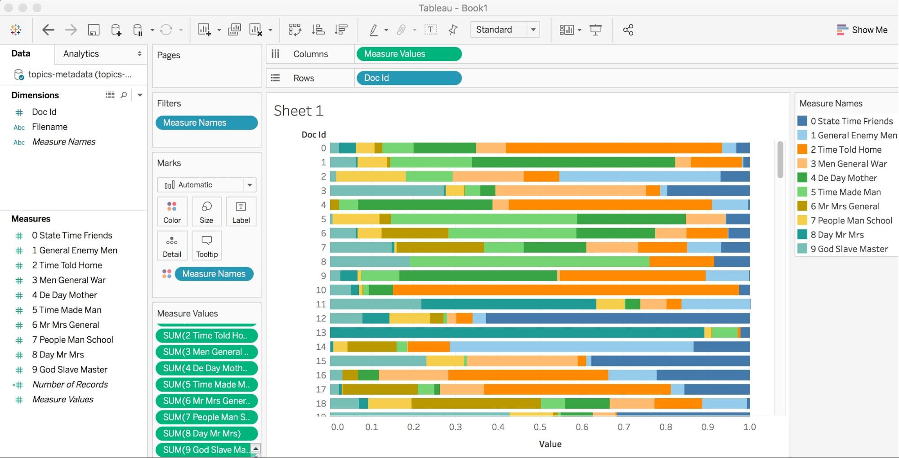

## Text-mining, Text-analysis: distant reading & close reading

**Research Question**: What themes occur in the documents collected in the [First Person Narratives](https://docsouth.unc.edu/fpn/) in the “Documenting the American South” collection? 

This collection offers "many Southerners' perspectives on their lives by presenting letters, memoirs, autobiographies and other writings by slaves, laborers, women, aristocrats, soldiers, and officers.”

https://docsouth.unc.edu/fpn/texts.html   We can navigate the collection [by subject](https://docsouth.unc.edu/browse/subject/index.html?letter=R), but that often won’t help us with themes that are more nuanced. E.g. How is slavery depicted?  

### Part A: Text mining: Unsupervised Learning -- what can a computer “learn”? We’re not telling it, at least initially, which words to look for.  

#### Terminology for Topic-Modeling:    
* **Documents**: texts in separate files
* **Topics**: themes made up of words that occur with each other in the same documents 
* **Model**: the proportion of topics in a document within a corpus of documents. A model provides a distant-view of an entire corpus, or collection of texts.  Each document has a list of topics and their proportions, e.g. Document 1 includes 20% of Topic A, 50% of Topic B.    

#### Example of how topic modeling can be used: 
* Find similar/dissimilar texts: In full-text databases, such as Web of Science, JStor, etc, we can cluster articles based on this model (thematic profile), without relying upon metadata that might be outdated.  

1. **Input**: Texts from Doc South -- https://docsouth.unc.edu/fpn/   (zipped file that includes a folder called “texts” in a folder called “data”)
2. **Process**: unsupervised learning method = Topic Modeling.  What is a topic “model”? 
  * Download the application from GitHub: [Here](https://github.com/senderle/topic-modeling-tool). 
  * There’s a link to the Quickstart Guide: https://senderle.github.io/topic-modeling-tool/documentation/2017/01/06/quickstart.html 
3. **Output**: html & csv files.  
  We want to visualize results: 
4. **Input II**: convert the topics-metadata.csv file into Excel -- pull into Tableau.  
  We want to see the “model” i.e., the proportion of topics in the documents.  
  We could look for documents that have similar proportions of topics.  

  Rows = (Dimensions) the Documents, 
  Columns show the proportion (Measures) of Topics. 
  
[insert image]

What to do if…
* Q. I see lots of words, the, a, an, mr, mrs, that are not helpful. 
    * A. You can make a list of “stop-words” that are removed from results. 
* Q. The topics don’t seem meaningful.  
    * A. Topic modeling relies on at least 200 texts.  This example has only 150 texts.  (It’s probably not the best example.)  
* Q. I’m working with twitter data, and, the texts are very short. 
    * A. Try combine one day’s tweets.  Or combine all tweets over a specific time from one person.  There are lots of ways to create/combine “documents”.  
* Q. I want to compare one group of texts with another.  
    * A. Try grouping/sorting the results according to attributes. In your spreadsheet you could include additional columns with attributes for each text. Add in a column for dates the texts were written or the gender of the author. 

### Part B: Text Analysis: relies on user to select keywords.  
We’d change our research question slightly: giving Voyant specific words to look for. 
1. **Voyant**: https://voyant-tools.org/ 
  * Try uploading the zip file. 
  * Show how to adjust stopwords to remove frequently-used words from results.  
  * Relative frequencies, (rather than word-counts)  because texts come in different sizes. 

[insert image]

### Part C: Compare  What are advantages of each method?  When to use one, when to use the other?  
 Hint: what about words such as “lead” -- can be a verb and a noun?     
 Sample questions:  What if we wanted to know whether the texts written by women are more are more religious than texts written by men?  

#### Test questions:
* The proceedings (1674-1913) of London’s criminal courts have been digitized and made available online.  Is this interface using text-analysis or topic-modeling?  https://www.oldbaileyonline.org/forms/formMain.jsp 
* David Mimno created a web-based interface that allows users to use topic-modeling by uploading their own texts.  Why would he choose the U.S. State of the Union Addresses  as a demonstration? 
* Here’s an example of topic modeling on the State of the Union addresses over time.  What themes dominate in Clinton, Bush, and Obama’s addresses?  
* Yoh has transcribed his interviews and wants to code themes in Atlas.ti. Would topic modeling or text-analysis be useful to him? 

## Part D: More

For more in-depth work:
* Topic Modeling: Programming Historian, MALLET:   https://programminghistorian.org/en/lessons/topic-modeling-and-mallet 
* AntConc: For text-analysis -- at a much larger scale https://programminghistorian.org/en/lessons/corpus-analysis-with-antconc 

## Part E. More -- text-analysis with “enhanced” texts.  

For examples of what you can do with a lemmatized (root forms of each word), morphologically marked-up text (parts-of-speech), take a look at WordHoard: http://wordhoard.northwestern.edu/ 
It’s a text-analysis tool that is bundled with a corpus of texts that have been marked up (encoded) to allow more sophisticated searches.   

What if you want to ask the following questions about Shakespeare’s plays: Do men and women differ in the frequency with which they talk about 'love'? Is 'love' more often the subject of verse than prose?

[insert image]

What does such a text look like?  Each word is “tagged” with meta-data. 
* My dog loves lead.  
* My dog is the love of my life. 
http://nlp.stanford.edu:8080/parser/index.jsp 

#### Some example of text-analysis tools incorporated into text collections:
